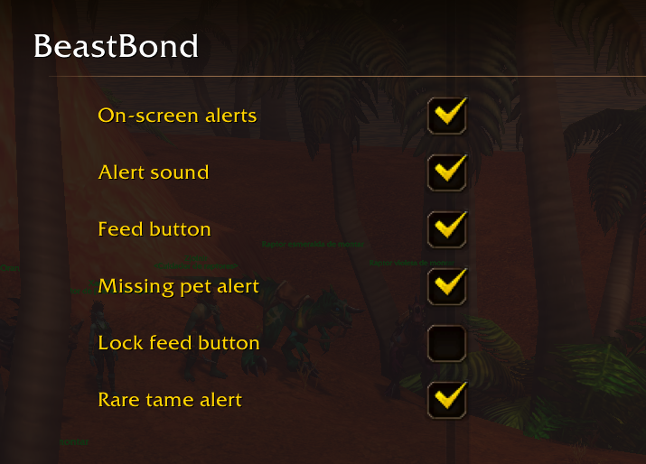
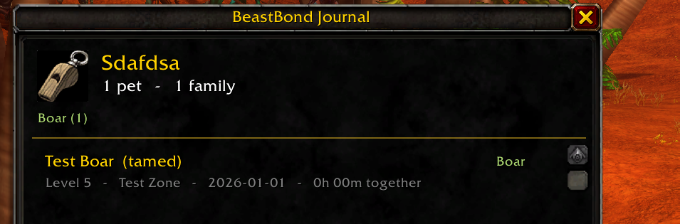

**A hunter is only as strong as the bond with their beast.**

BeastBond is the hunter pet companion addon for **World of Warcraft: Forever**. Keep your beast fed, happy and at your side, watch your bond grow from *Newly Tamed* to *Soulbound*, and keep a legend of every companion that ever fought beside you.

> ### Join the hunt: help me forge it
> BeastBond has been tested in the Forever beta client, and I'd love more Hunters to take it into the wild with their own companions and tell me how it feels. Every report, good or bad, makes it stronger. The [5 minute checklist](docs/TESTING.md) shows what to try.

| Settings | Pet journal |
|---|---|
|  |  |

## What your beast gets
- **Companion card**: portrait, name, mood face and a bond bar, always where you can see it.
- **Forge the bond**: five ranks, *Newly Tamed*, *Pack Mate*, *Trusted Companion*, *Battle-Bonded* and *Soulbound*, earned by hunting together. A message tells you when you rank up.
- **Pet happiness alerts, by name**: "Rex is getting hungry." "Rex is very unhappy! Feed them before they run away." Beast mastery without the guesswork.
- **Feed pet in one click**: a native-looking button appears when your pet is hungry and you carry food they like. It shows your food count and steps aside in combat.
- **Never walk alone**: reminders to Call Pet or Revive Pet, quiet while you're mounted or on a taxi.
- **Pet journal**: your legend of every beast, with family, level, zone, time together and bond rank.
- **Our Story**: every pet gets its own story, written as you play: the day you met, rank-ups, milestones, zones explored, the times you nursed them back to health. Copy it and share it.
- **Rare tame tracker**: an alert when a rare creature worth taming crosses your path.

Everything can be switched on or off. See the [manual](docs/MANUAL.md).

## Install
- **CurseForge**: install with the CurseForge app (search "BeastBond"), or download the zip from the project page.
- **Manual**: unzip so the folder is `Interface/AddOns/BeastBond/BeastBond.toc` inside your Forever client folder, then restart the game or type `/reload`.

Type `/bb` in game to open the settings. No pet yet? Try `/bb test card` and `/bb test unhappy` to see it in action.

## Commands
| Command | What it does |
|---|---|
| `/bb` | open settings |
| `/bb journal` | open the pet journal (`reset confirm` clears it) |
| `/bb module <name> on\|off` | enable/disable a module: Guardian, FeedButton, Tracker, Journal, PetCard |
| `/bb reset` | reset the feed button and companion card positions |
| `/bb test <state>` | see an alert, the card or the feed button without a pet (`/bb test` lists them) |
| `/bb about` | version and feedback links |
| `/bb debug` | print diagnostic info (attach it to bug reports) |

## Tested, and looking for more hunters
Checked in the Forever beta client: loading, settings, every command, and each alert, the card, the feed button, the tracker and the journal through the built-in `/bb test` simulations.

Where I'd love your help is confirming it with real pets in everyday play:
- the mood face and alerts match what your pet is really feeling
- the feed button feeds with the food you carry
- the "tamed" mark appears when you tame a new pet
- the rare tame alert shows up on real rare creatures

## Give feedback
- **Something broke or looks off?** [Open a bug report](../../issues/new/choose). Include the Lua error (BugSack, or `/console scriptErrors 1`) and the output of `/bb debug` with your pet out.
- **Works great?** Tell me too: [share a test report](../../issues/new/choose). It really helps.
- **Ideas?** Same place. What would make your beast feel more legendary?

## Coming later
- Share your companion card with friends (you can already copy your pet's story from the journal)
- Bond milestones and pet anniversaries

## Contributing
See [CONTRIBUTING.md](CONTRIBUTING.md).

## License
MIT
